# Full Architecture: Quad-Hybrid + ETD + LaDiR + Block Diffusion

**차세대 LLM을 위한 통합 아키텍처 (ATLAS 통합)**

---

## 1. 전체 아키텍처 개요

### 핵심 개념: 4가지 메모리 시스템 + 수직 레이어 스택


![Full Architecture](https://mermaid.ink/img/JSV7aW5pdDogeyd0aGVtZSc6ICduZXV0cmFsJywgJ3RoZW1lVmFyaWFibGVzJzogeyAnZm9udEZhbWlseSc6ICdUaW1lcyBOZXcgUm9tYW4nLCAnZm9udFNpemUnOiAnMTRweCcsICdwcmltYXJ5Q29sb3InOiAnI2ZmZicsICdlZGdlTGFiZWxCYWNrZ3JvdW5kJzonI2ZmZicsICdjbHVzdGVyQmtnJzogJyNmOWY5ZjknLCAnY2x1c3RlckJvcmRlcic6ICcjNjY2JyB9fX0lJQpncmFwaCBURAogICAgc3ViZ3JhcGggRnVsbEFyY2hpdGVjdHVyZSBbIkZVTEwgQVJDSElURUNUVVJFIChEYXRhIEZsb3cpIl0KICAgICAgICBkaXJlY3Rpb24gVEIKICAgICAgICBJbnB1dFtJbnB1dCBTZXF1ZW5jZTxici8+UXVlc3Rpb24gVG9rZW5zXSAtLT4gQmFja2JvbmUKICAgICAgICAKICAgICAgICBzdWJncmFwaCBCYWNrYm9uZSBbIkJBQ0tCT05FICsgRVREIChRdWFkLUh5YnJpZCBsYXllcnMgb3JnYW5pemVkIGJ5IEVURCkiXQogICAgICAgICAgICBkaXJlY3Rpb24gTFIKICAgICAgICAgICAgRW5jb2RlcltFTkNPREVSIDg8YnIvPkFUTFxNM1xHRDxici8+R0RcR0FcR0Q8YnIvPk0zXEdBXCBdIC0tPiBUaGlua1tUSElOSyAyNCwgTiBpdGVyYXRpb25zPGJyLz5BVExcTTNcTTNcR0RcR0RcR0E8YnIvPi4uLiB4MjQ8YnIvPitSb3V0ZXIgK0V4cGVydF0KICAgICAgICAgICAgVGhpbmsgLS0+IERlY29kZXJbREVDT0RFUiA4PGJyLz5HQVxHQVxHRDxici8+R0FcTTNcR0E8YnIvPkdEXE0zXCBdCiAgICAgICAgZW5kCiAgICAgICAgCiAgICAgICAgQmFja2JvbmUgLS0+IExhRGlSCiAgICAgICAgCiAgICAgICAgc3ViZ3JhcGggTGFEaVIgWyJMYURpUjogTEFURU5UIFJFQVNPTklORyAoQXBwZW5kIE1lbW9yeSBTbG90cykiXQogICAgICAg     ... (truncated for thought)
![Full Architecture](https://mermaid.ink/img/JSV7aW5pdDogeyd0aGVtZSc6ICduZXV0cmFsJywgJ3RoZW1lVmFyaWFibGVzJzogeyAnZm9udEZhbWlseSc6ICdUaW1lcyBOZXcgUm9tYW4nLCAnZm9udFNpemUnOiAnMTRweCcsICdwcmltYXJ5Q29sb3InOiAnI2ZmZicsICdlZGdlTGFiZWxCYWNrZ3JvdW5kJzonI2ZmZicsICdjbHVzdGVyQmtnJzogJyNmOWY5ZjknLCAnY2x1c3RlckJvcmRlcic6ICcjNjY2JyB9fX0lJQpncmFwaCBURAogICAgc3ViZ3JhcGggRnVsbEFyY2hpdGVjdHVyZSBbIkZVTEwgQVJDSElURUNUVVJFIChEYXRhIEZsb3cpIl0KICAgICAgICBkaXJlY3Rpb24gVEIKICAgICAgICBJbnB1dFtJbnB1dCBTZXF1ZW5jZTxici8+UXVlc3Rpb24gVG9rZW5zXSAtLT4gQmFja2JvbmUKICAgICAgICAKICAgICAgICBzdWJncmFwaCBCYWNrYm9uZSBbIkJBQ0tCT05FICsgRVREIChRdWFkLUh5YnJpZCBsYXllcnMgb3JnYW5pemVkIGJ5IEVURCkiXQogICAgICAgICAgICBkaXJlY3Rpb24gTFIKICAgICAgICAgICAgRW5jb2RlcltFTkNPREVSIDg8YnIvPkFUTFxNM1xHRDxici8+R0RcR0FcR0Q8YnIvPk0zXEdBXCBdIC0tPiBUaGlua1tUSElOSyAyNCwgTiBpdGVyYXRpb25zPGJyLz5BVExcTTNcTTNcR0RcR0RcR0E8YnIvPi4uLiB4MjQ8YnIvPitSb3V0ZXIgK0V4cGVydF0KICAgICAgICAgICAgVGhpbmsgLS0+IERlY29kZXJbREVDT0RFUiA4PGJyLz5HQVxHQVxHRDxici8+R0FcTTNcR0E8YnIvPkdEXE0zXCBdCiAgICAgICAgZW5kCiAgICAgICAgCiAgICAgICAgQmFja2JvbmUgLS0+IExhRGlSCiAgICAgICAgCiAgICAgICAgc3ViZ3JhcGggTGFEaVIgWyJMYURpUjogTEFURU5UIFJFQVNPTklORyAoQXBwZW5kIE1lbW9yeSBTbG90cykiXQogICAgICAgICAgICBkaXJlY3Rpb24gVEIKICAgICAgICAgICAgSGlkZGVuW0hpZGRlbiBTdGF0ZXNdIC0tPiBTbG90c1srIE1FTTEgTUVNMiBNRU0zXQogICAgICAgICAgICBTbG90cyAtLT4gVkFFX0VuY1tWQUUgRW5jb2RlcjogTWVtb3J5IFNsb3RzIC0+IExhdGVudCB6XQogICAgICAgICAgICBWQUVfRW5jIC0tPiBGbG93W0Zsb3cgTWF0Y2hpbmc6IE5vaXNlIC0+IExhdGVudCB6XQogICAgICAgICAgICBGbG93IC0tPiBQcm9waGV0W1Byb3BoZXQ6IEVhcmx5IEV4aXQgdmlhIENvbmZpZGVuY2UgR2FwXQogICAgICAgICAgICBQcm9waGV0IC0tPiBWQUVfRGVjW1ZBRSBEZWNvZGVyOiBMYXRlbnQgeiAtPiBNZW1vcnkgU2xvdHNdCiAgICAgICAgICAgIFZBRV9EZWMgLS0+IE91dHB1dGlkZGVuW0hpZGRlbiBTdGF0ZXMgd2l0aCBSZWFzb25pbmddCiAgICAgICAgZW5kCiAgICAgICAgCiAgICAgICAgTGFEaVIgLS0+IE91dHB1dAogICAgICAgIAogICAgICAgIHN1YmdyYXBoIE91dHB1dCBbIk9VVFBVVDogQmxvY2sgRGlmZnVzaW9uIChBUiArIERpZmZ1c2lvbiBIeWJyaWQpIl0KICAgICAgICAgICAgZGlyZWN0aW9uIFRCCiAgICAgICAgICAgIEJsb2NrMVtCbG9jayAxOiBNQVNLIC0+IERpZmZ1c2lvbiAtPiBUb2tlbnNdCiAgICAgICAgICAgIEJsb2NrMltCbG9jayAyOiBNQVNLIC0+IERpZmZ1c2lvbiAtPiBUb2tlbnNdCiAgICAgICAgICAgIEJsb2NrMSAtLT4gQmxvY2syCiAgICAgICAgICAgIE5vdGVbVW5pZmllZCBEaWZmdXNpb24gUGFyYWRpZ20gd2l0aCBMYURpUl0KICAgICAgICBlbmQKICAgICAgICAKICAgICAgICBPdXRwdXQgLS0+IEZpbmFsVG9rZW5zW09VVFBVVCBUT0tFTlNdCiAgICBlbmQ=)

<!-- Full Architecture Mermaid Code
```mermaid
%%{init: {'theme': 'neutral', 'themeVariables': { 'fontFamily': 'Times New Roman', 'fontSize': '14px', 'primaryColor': '#fff', 'edgeLabelBackground':'#fff', 'clusterBkg': '#f9f9f9', 'clusterBorder': '#666' }}}%%
graph TD
    subgraph FullArchitecture ["FULL ARCHITECTURE (Data Flow)"]
        direction TB
        Input[Input Sequence<br/>Question Tokens] --> Backbone
        
        subgraph Backbone ["BACKBONE + ETD (Quad-Hybrid layers organized by ETD)"]
            direction LR
            Encoder[ENCODER 8<br/>ATL|M3|GD<br/>GD|GA|GD<br/>M3|GA| ] --> Think[THINK 24, N iterations<br/>ATL|M3|M3|GD|GD|GA<br/>... x24<br/>+Router +Expert]
            Think --> Decoder[DECODER 8<br/>GA|GA|GD<br/>GA|M3|GA<br/>GD|M3| ]
        end
        
        Backbone --> LaDiR
        
        subgraph LaDiR ["LaDiR: LATENT REASONING (Append Memory Slots)"]
            direction TB
            Hidden[Hidden States] --> Slots[+ MEM1 MEM2 MEM3]
            Slots --> VAE_Enc[VAE Encoder: Memory Slots -> Latent z]
            VAE_Enc --> Flow[Flow Matching: Noise -> Latent z]
            Flow --> Prophet[Prophet: Early Exit via Confidence Gap]
            Prophet --> VAE_Dec[VAE Decoder: Latent z -> Memory Slots]
            VAE_Dec --> OutputHidden[Hidden States with Reasoning]
        end
        
        LaDiR --> Output
        
        subgraph Output ["OUTPUT: Block Diffusion (AR + Diffusion Hybrid)"]
            direction TB
            Block1[Block 1: MASK -> Diffusion -> Tokens]
            Block2[Block 2: MASK -> Diffusion -> Tokens]
            Block1 --> Block2
            Note[Unified Diffusion Paradigm with LaDiR]
        end
        
        Output --> FinalTokens[OUTPUT TOKENS]
    end
```
-->

---

## 2. Quad-Hybrid: 4가지 메모리 시스템

### ATLAS가 추가된 이유: 차세대 소형 모델의 핵심

기존 Triple-Hybrid (Mamba-3 + DeltaNet + Attention)는 최대 ~100K 토큰 컨텍스트를 처리했습니다.
**ATLAS(Neural Long-term Memory)**는 이를 **10M+ 토큰**까지 확장하며, **80%+ 정확도**를 유지합니다.

**소형 모델 아키텍처 설계 (Small Model Architecture):**
ATLAS는 모델의 파라미터 크기(Static Weights)를 키우지 않고도, **메모리 용량(Memory Capacity)**을 기하급수적으로 늘리는 핵심 기술입니다.
*   **Polynomial Kernel**: 입력 차원을 고차원으로 매핑하여 $O(d^p)$의 메모리 용량을 확보합니다.
*   **Deep MLP Memory**: 단순 행렬이 아닌 깊은 신경망에 데이터를 저장하여, 적은 파라미터로도 복잡한 장기 의존성을 학습합니다.
이로 인해 **"작은 모델, 무한한 컨텍스트"**가 가능해집니다.

![Quad-Hybrid Memory](https://mermaid.ink/img/JSV7aW5pdDogeyd0aGVtZSc6ICduZXV0cmFsJywgJ3RoZW1lVmFyaWFibGVzJzogeyAnZm9udEZhbWlseSc6ICdUaW1lcyBOZXcgUm9tYW4nLCAnZm9udFNpemUnOiAnMTRweCcsICdwcmltYXJ5Q29sb3InOiAnI2ZmZicsICdlZGdlTGFiZWxCYWNrZ3JvdW5kJzonI2ZmZicsICdjbHVzdGVyQmtnJzogJyNmOWY5ZjknLCAnY2x1c3RlckJvcmRlcic6ICcjNjY2JyB9fX0lJQptaW5kbWFwCiAgcm9vdCgoUVVBRC1IWUJSSUQ8YnIvPk1FTU9SWSBTWVNURU1TKSkKICAgIEFUTEFTWyIxLiBBVExBUyAoMTAlKTxici8+TmV1cmFsIExvbmctdGVybSBNZW1vcnkiXQogICAgICBDYXBhY2l0eVsiMTBNKyBUb2tlbnMiXQogICAgICBPbWVnYVsiT21lZ2EgUnVsZTxici8+KFdpbmRvdyBPcHRpbWl6YXRpb24pIl0KICAgICAgUG9seVsiUG9seW5vbWlhbCBLZXJuZWw8YnIvPihPKGRecCkgQ2FwYWNpdHkpIl0KICAgICAgRGVlcE1MUFsiRGVlcCBNTFAgTWVtb3J5PGJyLz4oMisgTGF5ZXJzKSJdCiAgICAgIE11b25bIk11b24gT3B0aW1pemVyPGJyLz4oMm5kIE9yZGVyKSJdCiAgICBNYW1iYTNbIjIuIE1hbWJhLTMgKDM1JSk8YnIvPkRlZXAgTG9uZy10ZXJtIE1lbW9yeSJdCiAgICAgIENhcGFjaXR5TVsifjEwMEsgVG9rZW5zIl0KICAgICAgQ29tcGxleFsiQ29tcGxleCBTU00iXQogICAgICBPc2NpbGxbIk9zY2lsbGF0b3J5IER5bmFtaWNzIl0KICAgICAgTG9uZ0RlcFsiTG9uZy10ZXJtIERlcGVuZGVuY3kiXQogICAgRGVsdGFOZXRbIjMuIEdhdGVkIERlbHRhTmV0ICgzNSUpPGJyLz5IaWdoLXNwZWVkIFdvcmtpbmcgTWVtb3J5Il0KICAgICAgQ2FwYWNpdHlEWyJ+MTBLIFRva2VucyJdCiAgICAgIERlbHRhWyJEZWx0YSBSdWxlIFVwZGF0ZSJdCiAgICAgIEFzc29jWyJBc3NvY2lhdGl2ZSBNYXRyaXgiXQogICAgICBSZWFsVGltZVsiUmVhbC10aW1lIFVwZGF0ZSJdCiAgICBBdHRlbnRpb25bIjQuIEdhdGVkIEF0dGVudGlvbiAoMjAlKTxici8+Rm9jdXNlZCBBdHRlbnRpb24iXQogICAgICBDYXBhY2l0eUFbIkNvbnRleHQgV2luZG93ICg4Sy0xMjhLKSJdCiAgICAgIFByZWNpc2VbIlByZWNpc2UgUmV0cmlldmFsIl0KICAgICAgS1ZDYWNoZVsiS1YgQ2FjaGUiXQogICAgICBDb3JlSW5mb1siQ29yZSBJbmZvIEFjY2VzcyJd)

<!-- Quad-Hybrid Memory Mermaid Code
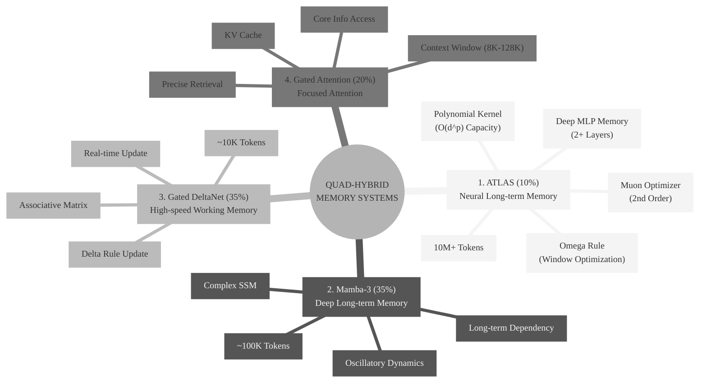
-->

### 2.1 Gated DeltaNet & Gated Attention Detail

Qwen3-Next에서 사용되는 **Gated DeltaNet**과 **Gated Attention** 블록의 상세 구조입니다.

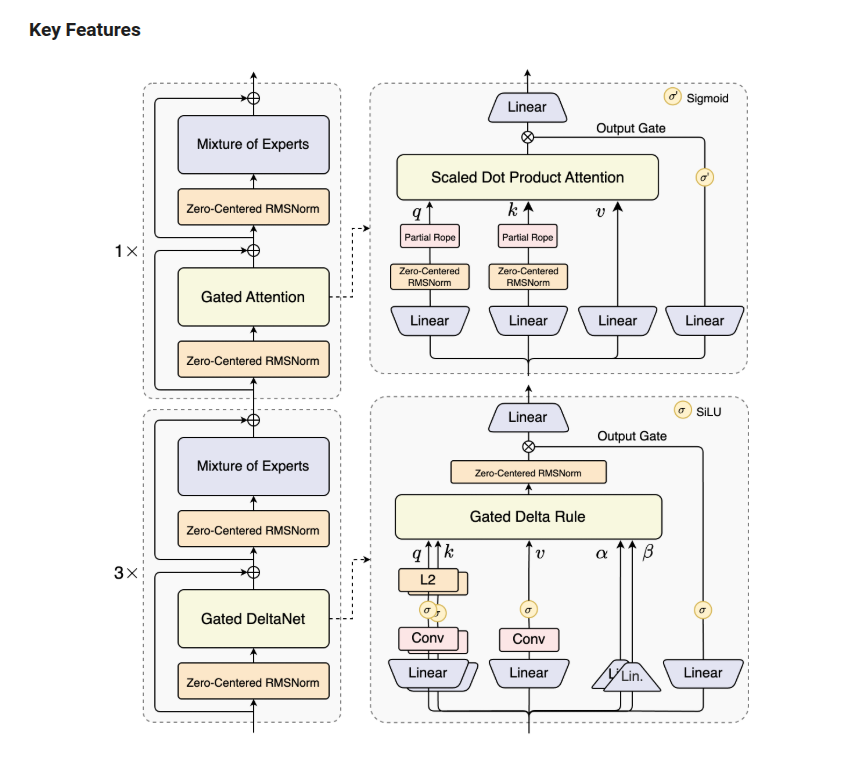

**주요 특징:**
- **Gated DeltaNet**: Delta Rule SSM + Output Gate + Zero-Centered RMSNorm
- **Gated Attention**: Flash Attention + Output Gate + Partial RoPE
- **MoE Integration**: MLP 대신 Ultra-Sparse MoE 적용 (위 그림에는 생략됨, 전체 구조도 참조)


### 2.2 Detailed Architecture Diagram (Mermaid)

This diagram illustrates the **Macro Architecture** (Left) and the detailed internal structure of **Gated Attention** (Top Right) and **Gated DeltaNet** (Bottom Right).

**Key Features Verified in SGLang Code (`qwen3_next.py`):**
*   **Layer Composition:** The model uses a mix of `Qwen3HybridLinearDecoderLayer` (Gated DeltaNet) and `Qwen3HybridAttentionDecoderLayer` (Gated Attention).
*   **MoE Attachment:** **Confirmed:** Mixture of Experts (MoE) is attached to **ALL** layer types. Both `Qwen3HybridLinearDecoderLayer` and `Qwen3HybridAttentionDecoderLayer` have `self.is_layer_sparse = True` hardcoded, forcing the use of `Qwen2MoeSparseMoeBlock`.
*   **Gated Attention:** Uses `RadixAttention`, `QKVParallelLinear`, `RowParallelLinear`, and `GemmaRMSNorm` for Q/K normalization. Supports `attn_output_gate` (Sigmoid).
*   **Gated DeltaNet:** Uses `Qwen3GatedDeltaNet` with `RMSNormGated`, `ColumnParallelLinear` for `conv1d`/`in_proj`, and `RowParallelLinear` for `out_proj`.

![Detailed Architecture Diagram](https://mermaid.ink/img/Z3JhcGggVEQKICAgICUlIEdsb2JhbCBTdHlsZXMKICAgIGNsYXNzRGVmIG5vcm0gZmlsbDojZjllNGNlLHN0cm9rZTojZGJiMDg0LGNvbG9yOmJsYWNrOwogICAgY2xhc3NEZWYgbW9kdWxlIGZpbGw6I2UxZTVmMixzdHJva2U6IzlmYTZiZixjb2xvcjpibGFjazsKICAgIGNsYXNzRGVmIGdhdGUgZmlsbDojZmZmOWM0LHN0cm9rZTojZDRjNjY3LGNvbG9yOmJsYWNrOwogICAgY2xhc3NEZWYgb3AgZmlsbDojZmZmZmZmLHN0cm9rZTojMzMzLGNvbG9yOmJsYWNrOwogICAgY2xhc3NEZWYgaW5wdXQgZmlsbDojZmZmZmZmLHN0cm9rZTojMzMzLHN0cm9rZS1kYXNoYXJyYXk6IDUgNSxjb2xvcjpibGFjazsKCiAgICAlJSA9PT09PT09PT09PT09PT09PT09PT09PT09PT09PT09PT09PT09PT09PT0KICAgICUlIDEuIE1hY3JvIEFyY2hpdGVjdHVyZSAoTGVmdCBNYWluIFN0YWNrKQogICAgJSUgPT09PT09PT09PT09PT09PT09PT09PT09PT09PT09PT09PT09PT09PT09CiAgICBzdWJncmFwaCBNYWNyb0FyY2ggW01hY3JvIEFyY2hpdGVjdXJlXQogICAgICAgIGRpcmVjdGlvbiBCVAogICAgICAgIE1fSW5wdXQoKElucHV0KSkKICAgICAgICAKICAgICAgICAlJSAzeCBCbG9jayAoR2F0ZWQgRGVsdGFOZXRpKQogICAgICAgIHN1YmdyYXBoIEJsb2NrM3ggWzN4IExvb3AgQmxvY2tdCiAgICAgICAgICAgIGRpcmVjdGlvbiBCVAogICAgICAgICAgICBNX04xW1plcm8tQ2VudGVyZWQgUk1TTm9ybV06Ojpub3JtCiAgICAgICAgICAgIE1fR0ROW0dhdGVkIERlbHRhTmV0XTo6OmdhdGUKICAgICAgICAgICAgTV9BZGQxKCgrKSk6OjpvcAogICAgICAgICAgICAKICAgICAgICAgICAgTV9OMltaZXJvLUNlbnRlcmVkIFJNU05vcm1dOjo6bm9ybQogICAgICAgICAgICBNX01vRTFbTWl4dHVyZSBvZiBFeHBlcnRzXTo6Om1vZHVsZQogICAgICAgICAgICBNX0FkZDIoKCspKTo6Om9wCiAgICAgICAgICAgIAogICAgICAgICAgICAlJSBDb25uZWN0aW9ucwogICAgICAgICAgICBNX0lucHV0IC0tPiBNX04xCiAgICAgICAgICAgIE1fR0ROIC0tPiBNX0FkZDEKICAgICAgICAgICAgTV9JbnB1dCAtLT4gTV9BZGQxCiAgICAgICAgICAgIAogICAgICAgICAgICBNX0FkZDEgLS0+IE1fTjIKICAgICAgICAgICAgTV_OMiAtLT4gTV9Nb0UxCiAgICAgICAgICAgIE1fTW9FMSAtLT4gTV9BZGQyCiAgICAgICAgICAgIE1fQWRkMSAtLT4gTV9BZGQyCiAgICAgICAgZW5kCgogICAgICAgICUlIDF4IEJsb2NrIChHYXRlZCBBdHRlbnRpb24pCiAgICAgICAgc3ViZ3JhcGggQmxvY2sxeCBbMXggQmxvY2tdCiAgICAgICAgICAgIGRpcmVjdGlvbiBCVAogICAgICAgICAgICBNX04zW1plcm8tQ2VudGVyZWQgUk1TTm9ybV06Ojpub3JtCiAgICAgICAgICAgIE1fR0FbR2F0ZWQgQXR0ZW50aW9uXTo6OmdhdGUKICAgICAgICAgICAgTV9BZGQzKCgrKSk6OjpvcAogICAgICAgICAgICAKICAgICAgICAgICAgTV9ONFtaZXJvLUNlbnRlcmVkIFJNU05vcm1dOjo6bm9ybQogICAgICAgICAgICBNX01vRTJbTWl4dHVyZSBvZiBFeHBlcnRzXTo6Om1vZHVsZQogICAgICAgICAgICBNX0FkZDQoKCspKTo6Om9wCiAgICAgICAgICAgIAogICAgICAgICAgICAlJSBDb25uZWN0aW9ucwogICAgICAgICAgICBNX0FkZDIgLS0+IE1fTjMKICAgICAgICAgICAgTV9OMyAtLT4gTV9HQQogICAgICAgICAgICBNX0dBIC0tPiBNX0FkZDMKICAgICAgICAgICAgTV9BZGQyIC0tPiBNX0FkZDMKICAgICAgICAgICAgCiAgICAgICAgICAgIE1fQWRkMyAtLT4gTV9ONAogICAgICAgICAgICBNX040IC0tPiBNX01vRTIKICAgICAgICAgICAgTV9Nb0UyIC0tPiBNX0FkZDQKICAgICAgICBlbmQKICAgICAgICAKICAgICAgICBNX0FkZDQgLS0+IE1fT3V0cHV0KChPdXRwdXQpKQogICAgZW5kCgogICAgJSUgPT09PT09PT09PT09PT09PT09PT09PT09PT09PT09PT09PT09PT09PT09CiAgICAlJSAyLiBHYXRlZCBBdHRlbnRpb24gRGV0YWlsIChUb3AgUmlnaHQpCiAgICAlJSA9PT09PT09PT09PT09PT09PT09PT09PT09PT09PT09PT09PT09PT09PT0KICAgIHN1YmdyYXBoIEdBRGV0YWlsIFtEZXRhaWw6IEdhdGVkIEF0dGVudGlvbl0KICAgICAgICBkaXJlY3Rpb24gQlQKICAgICAgICBHQV9JbltJbnB1dF06OjppbnB1dAogICAgICAgIAogICAgICAgICUlIExheWVycwogICAgICAgIEdBX0xfUVtMaW5lYXJdOjo6bW9kdWxlCiAgICAgICAgR0FfTF9LW0xpbmVhcl06Ojptb2R1bGUKICAgICAgICBHQV9MX1ZbTGluZWFyXTo6Om1vZHVsZQogICAgICAgIEdBX0xfR2F0ZVtMaW5lYXJdOjo6bW9kdWxlCiAgICAgICAgCiAgICAgICAgR0FfSW4gLS0+IEdBX0xfUSAmIEdBX0xfSyAmIEdBX0xfViAmIEdBX0xfR2F0ZQogICAgICAgIAogICAgICAgICUlIFEgcGF0aAogICAgICAgIEdBX0xfUSAtLT4gR0FfTl9RW1plcm8tQ2VudGVyZWQgUk1TTm9ybV06Ojpub3JtCiAgICAgICAgR0FfTl9RIC0tPiBHQV9Sb3BlX1FbUGFydGlhbCBSb3BlXTo6Om9wCiAgICAgICAgR0FfUm9wZV9RIC0tPiBHQV9xW3FdCiAgICAgICAgCiAgICAgICAgJSUgSyBwYXRoCiAgICAgICAgR0FfTF9LIC0tPiBHQV9OX0tbWmVyby1DZW50ZXJlZCBSTVNOb3JtXTo6Om5vcm0KICAgICAgICBHQV9OX0sgLS0+IEdBX1JvcGVfS1tQYXJ0aWFsIFJvcGVdOjo6b3AKICAgICAgICBHQV9Sb3BlX1sgLS0+IEdBX2tba10KICAgICAgICAKICAgICAgICAlJSBWIHBhdGgKICAgICAgICBHQV9MX1YgLS0+IEdBX3Zbdl0KICAgICAgICAKICAgICAgICAlJSBBdHRlbnRpb24KICAgICAgICBHQV9xICYgR0FfayAmIEdBX3YgLS0+IEdBX1NEUEFbU2NhbGVkIERvdCBQcm9kdWN0IEF0dGVudGlvbl06OjpnYXRlCiAgICAgICAgCiAgICAgICAgJSUgR2F0ZSBwYXRoCiAgICAgICAgR0FfTF9HYXRlIC0tPiBHQV9TaWdbU2lnbW9pZF06OjpvcAogICAgICAgIAogICAgICAgICUlIE91dHB1dCBNZXJnZQogICAgICAgIEdBX1NEUEEgLS0+IEdBX011bCgoeCkpOjo6b3AKICAgICAgICBHQV9TaWcgLS0gT3V0cHV0IEdhdGUgLS0+IEdBX011bAogICAgICAgIAogICAgICAgIEdBX011bCAtLT4gR0FfT3V0W0xpbmVhcl06Ojptb2R1bGUKICAgIGVuZAoKICAgICUlID09PT09PT09PT09PT09PT09PT09PT09PT09PT09PT09PT09PT09PT09PQogICAgJSUgMy4gR2F0ZWQgRGVsdGFOZXQgRGV0YWlsIChCb3R0b20gUmlnaHQpCiAgICAlJSA9PT09PT09PT09PT09PT09PT09PT09PT09PT09PT09PT09PT09PT09PT0KICAgIHN1YmdyYXBoIEdETkRldGFpbCBbRGV0YWlsOiBHYXRlZCBEZWx0YU5ldF0KICAgICAgICBkaXJlY3Rpb24gQlQKICAgICAgICBHRE_JbltJbnB1dF06OjppbnB1dAogICAgICAgIAogICAgICAgICUlIExpbmVhciBTcGxpdHMKICAgICAgICBHRF9MX1FLW0xpbmVhcl06Ojptb2R1bGUKICAgICAgICBHRF9MX1ZbTGluZWFyXTo6Om1vZHVsZQogICAgICAgIEdEX0xfQUJbTGluZWFyXTo6Om1vZHVsZQogICAgICAgIEdEX0xfR2F0ZVtMaW5lYXJdOjo6bW9kdWxlCiAgICAgICAgCiAgICAgICAgR0RfSW4gLS0+IEdEX0xfUUsgJiBHRF9MX1YgJiBHRF9MX0FCICYgR0RfTF9HYXRlCiAgICAgICAgCiAgICAgICAgJSUgcSwgayBQYXRoCiAgICAgICAgR0RfTF9RSyAtLT4gR0RfQ29udjFbQ29udl06OjpvcAogICAgICAgIEdEX0NvbnYxIC0tPiBHRF9TaWcxW3NpZ21hXTo6Om9wCiAgICAgICAgR0RfU2lnMSAtLT4gR0RfTDJbTDJdOjo6bm9ybQogICAgICAgIEdEX0wyIC0tPiBHRF9xa1txLCBrXQogICAgICAgIAogICAgICAgICUlIHYgUGF0aAogICAgICAgIEdEX0xfViAtLT4gR0RfQ29udjJbQ29udl06OjpvcAogICAgICAgIEdEX0NvbnYyIC0tPiBHRF9TaWcyW3NpZ21hXTo6Om9wCiAgICAgICAgR0RfU2lnMiAtLT4gR0Rfdlt2XQogICAgICAgIAogICAgICAgICUlIGFscGhhLCBiZXRhIFBhdGgKICAgICAgICBHRF9MX0FCIC0tPiBHRF9MaW5UcmlbTGluLl06OjpvcAogICAgICAgIEdEX0xpblRyaSAtLT4gR0RfYWJbYWxwaGEsIGJldGFdCiAgICAgICAgCiAgICAgICAgJSUgQ29yZSBSdWxlCiAgICAgICAgR0RfcWsgJiBHRF92ICYgR0RfYWIgLS0+IEdEX1J1bGVbR2F0ZWQgRGVsdGEgUnVsZV06OjpnYXRlCiAgICAgICAgCiAgICAgICAgJSUgR2F0ZSBQYXRoCiAgICAgICAgR0RfTF9HYXRlIC0tPiBHRF9TaUxVW1NpTFVdOjo6b3AKICAgICAgICAKICAgICAgICAlJSBPdXRwdXQgTWVyZ2UKICAgICAgICBHRF9SdWxlIC0tPiBHRF9Ob3JtW1plcm8tQ2VudGVyZWQgUk1TTm9ybV06Ojpub3JtCiAgICAgICAgR0RfTm9ybSAtLT4gR0RfTXVsKCh4KSk6OjpvcAogICAgICAgIEdEX1NpTFUgLS0gT3V0cHV0IEdhdGUgLS0+IEdBX011bAogICAgICAgIAogICAgICAgIEdEX011bCAtLT4gR0RfT3V0W0xpbmVhcl06Ojptb2R1bGUKICAgIGVuZAoKICAgICUlID09PT09PT09PT09PT09PT09PT09PT09PT09PT09PT09PT09PT09PT09PQogICAgJSUgUmVsYXRpb25zaGlwcwogICAgJSUgPT09PT09PT09PT09PT09PT09PT09PT09PT09PT09PT09PT09PT09PT09CiAgICBNX0dBIC0uLT4gR0FEZXRhaWwKICAgIE1fR0ROIC0uLT4gR0RORGV0YWls)

```mermaid
graph TD
    %% Global Styles
    classDef norm fill:#f9e4ce,stroke:#dbb084,color:black;
    classDef module fill:#e1e5f2,stroke:#9fa6bf,color:black;
    classDef gate fill:#fff9c4,stroke:#d4c667,color:black;
    classDef op fill:#ffffff,stroke:#333,color:black;
    classDef input fill:#ffffff,stroke:#333,stroke-dasharray: 5 5,color:black;

    %% ==========================================
    %% 1. Macro Architecture (Left Main Stack)
    %% ==========================================
    subgraph MacroArch [Macro Architecture]
        direction BT
        M_Input((Input))
        
        %% 3x Block (Gated DeltaNet)
        subgraph Block3x [3x Loop Block]
            direction BT
            M_N1[Zero-Centered RMSNorm]:::norm
            M_GDN[Gated DeltaNet]:::gate
            M_Add1((+)):::op
            
            M_N2[Zero-Centered RMSNorm]:::norm
            M_MoE1[Mixture of Experts]:::module
            M_Add2((+)):::op
            
            %% Connections
            M_Input --> M_N1
            M_N1 --> M_GDN
            M_GDN --> M_Add1
            M_Input --> M_Add1
            
            M_Add1 --> M_N2
            M_N2 --> M_MoE1
            M_MoE1 --> M_Add2
            M_Add1 --> M_Add2
        end

        %% 1x Block (Gated Attention)
        subgraph Block1x [1x Block]
            direction BT
            M_N3[Zero-Centered RMSNorm]:::norm
            M_GA[Gated Attention]:::gate
            M_Add3((+)):::op
            
            M_N4[Zero-Centered RMSNorm]:::norm
            M_MoE2[Mixture of Experts]:::module
            M_Add4((+)):::op
            
            %% Connections
            M_Add2 --> M_N3
            M_N3 --> M_GA
            M_GA --> M_Add3
            M_Add2 --> M_Add3
            
            M_Add3 --> M_N4
            M_N4 --> M_MoE2
            M_MoE2 --> M_Add4
            M_Add3 --> M_Add4
        end
        
        M_Add4 --> M_Output((Output))
    end

    %% ==========================================
    %% 2. Gated Attention Detail (Top Right)
    %% ==========================================
    subgraph GADetail [Detail: Gated Attention]
        direction BT
        GA_In[Input]:::input
        
        %% Layers
        GA_L_Q[Linear]:::module
        GA_L_K[Linear]:::module
        GA_L_V[Linear]:::module
        GA_L_Gate[Linear]:::module
        
        GA_In --> GA_L_Q & GA_L_K & GA_L_V & GA_L_Gate
        
        %% Q path
        GA_L_Q --> GA_N_Q[Zero-Centered RMSNorm]:::norm
        GA_N_Q --> GA_Rope_Q[Partial Rope]:::op
        GA_Rope_Q --> GA_q[q]
        
        %% K path
        GA_L_K --> GA_N_K[Zero-Centered RMSNorm]:::norm
        GA_N_K --> GA_Rope_K[Partial Rope]:::op
        GA_Rope_K --> GA_k[k]
        
        %% V path
        GA_L_V --> GA_v[v]
        
        %% Attention
        GA_q & GA_k & GA_v --> GA_SDPA[Scaled Dot Product Attention]:::gate
        
        %% Gate path
        GA_L_Gate --> GA_Sig[Sigmoid]:::op
        
        %% Output Merge
        GA_SDPA --> GA_Mul((x)):::op
        GA_Sig -- Output Gate --> GA_Mul
        
        GA_Mul --> GA_Out[Linear]:::module
    end

    %% ==========================================
    %% 3. Gated DeltaNet Detail (Bottom Right)
    %% ==========================================
    subgraph GDNDetail [Detail: Gated DeltaNet]
        direction BT
        GD_In[Input]:::input
        
        %% Linear Splits
        GD_L_QK[Linear]:::module
        GD_L_V[Linear]:::module
        GD_L_AB[Linear]:::module
        GD_L_Gate[Linear]:::module
        
        GD_In --> GD_L_QK & GD_L_V & GD_L_AB & GD_L_Gate
        
        %% q, k Path
        GD_L_QK --> GD_Conv1[Conv]:::op
        GD_Conv1 --> GD_Sig1[sigma]:::op
        GD_Sig1 --> GD_L2[L2]:::norm
        GD_L2 --> GD_qk[q, k]
        
        %% v Path
        GD_L_V --> GD_Conv2[Conv]:::op
        GD_Conv2 --> GD_Sig2[sigma]:::op
        GD_Sig2 --> GD_v[v]
        
        %% alpha, beta Path
        GD_L_AB --> GD_LinTri[Lin.]:::op
        GD_LinTri --> GD_ab[alpha, beta]
        
        %% Core Rule
        GD_qk & GD_v & GD_ab --> GD_Rule[Gated Delta Rule]:::gate
        
        %% Gate Path
        GD_L_Gate --> GD_SiLU[SiLU]:::op
        
        %% Output Merge
        GD_Rule --> GD_Norm[Zero-Centered RMSNorm]:::norm
        GD_Norm --> GD_Mul((x)):::op
        GD_SiLU -- Output Gate --> GD_Mul
        
        GD_Mul --> GD_Out[Linear]:::module
    end

    %% ==========================================
    %% Relationships
    %% ==========================================
    M_GA -.-> GADetail
    M_GDN -.-> GDNDetail
```

### 레이어 배치: 1:3.5:3.5:2 비율

![Layer Layout](https://mermaid.ink/img/JSV7aW5pdDogeyd0aGVtZSc6ICduZXV0cmFsJywgJ3RoZW1lVmFyaWFibGVzJzogeyAnZm9udEZhbWlseSc6ICdUaW1lcyBOZXcgUm9tYW4nLCAnZm9udFNpemUnOiAnMTRweCcsICdwcmltYXJ5Q29sb3InOiAnI2ZmZicsICdlZGdlTGFiZWxCYWNrZ3JvdW5kJzonI2ZmZicsICdjbHVzdGVyQmtnJzogJyNmOWY5ZjknLCAnY2x1c3RlckJvcmRlcic6ICcjNjY2JyB9fX0lJQpncmFwaCBURAogICAgc3ViZ3JhcGggTGF5b3V0IFsiUVVBRC1IWUJSSUQgTEFZRVIgTEFZT1VUICgxMCBMYXllciBFeGFtcGxlKSJdCiAgICAgICAgZGlyZWN0aW9uIFRCCiAgICAgICAgTDBbTGF5ZXIgMDogQVRMQVMgMTBNKyBUb2tlbnNdCiAgICAgICAgCiAgICAgICAgc3ViZ3JhcGggRExNIFtEZWVwIExvbmctdGVybSBNZW1vcnkgMzUlXQogICAgICAgICAgICBMMVtMYXllciAxOiBNYW1iYS0zXQogICAgICAgICAgICBMMltMYXllciAyOiBNYW1iYS0zXQogICAgICAgICAgICBMM1tMYXllciAzOiBNYW1iYS0zXQogICAgICAgICAgICBMNFtMYXllciA0OiBNYW1iYS0zXQogICAgICAgIGVuZAogICAgICAgIAogICAgICAgIHN1YmdyYXBoIEhXTSBbSGlnaC1zcGVlZCBXb3JraW5nIE1lbW9yeSAzNSVdCiAgICAgICAgICAgIEw1W0xheWVyIDU6IEdhdGVkIERlbHRhTmV0XQogICAgICAgICAgICBMNltMYXllciA2OiBHYXRlZCBEZWx0YU5ldF0KICAgICAgICAgICAgTDdbTGF5ZXIgNzogR2F0ZWQgRGVsdGFOZXRdCiAgICAgICAgZW5kCiAgICAgICAgCiAgICAgICAgc3ViZ3JhcGggRkEgW0ZvY3VzZWQgQXR0ZW50aW9uIDIwJV0KICAgICAgICAgICAgTDhbTGF5ZXIgODogR2F0ZWQgQXR0ZW50aW9uXQogICAgICAgICAgICBMOVtMYXllciA5OiBHYXRlZCBBdHRlbnRpb25dCiAgICAgICAgZW5kCiAgICAgICAgCiAgICAgICAgTDAgLS0+IEwxCiAgICAgICAgTDQgLS0+IEw1CiAgICAgICAgTDcgLS0+IEw4CiAgICBlbmQ=)

<!-- Layer Layout Mermaid Code
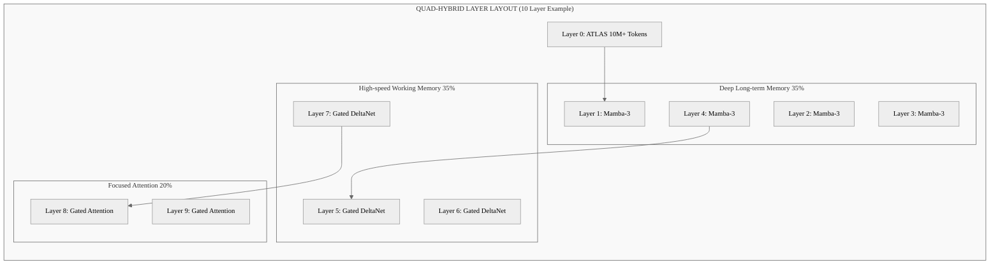
-->

### 2.1 Quad-Hybrid + MoE (Qwen3-Next Style)

Qwen3-Next의 **Ultra-Sparse MoE**를 통합하여 각 레이어의 MLP를 MoE로 대체한 구조입니다.

![Quad Hybrid + MoE Architecture](https://mermaid.ink/img/JSV7aW5pdDogeyd0aGVtZSc6ICduZXV0cmFsJywgJ3RoZW1lVmFyaWFibGVzJzogeyAnZm9udEZhbWlseSc6ICdUaW1lcyBOZXcgUm9tYW4nLCAnZm9udFNpemUnOiAnMTRweCcsICdwcmltYXJ5Q29sb3InOiAnI2ZmZicsICdlZGdlTGFiZWxCYWNrZ3JvdW5kJzonI2ZmZicsICdjbHVzdGVyQmtnJzogJyNmOWY5ZjknLCAnY2x1c3RlckJvcmRlcic6ICcjNjY2JyB9fX0lJQpncmFwaCBURAogICAgY2xhc3NEZWYgZGVmYXVsdCBmaWxsOiNmZmYsc3Ryb2tlOiMzMzMsc3Ryb2tlLXdpZHRoOjFweDsKICAgIGNsYXNzRGVmIGNsdXN0ZXIgZmlsbDojZjlmOWY5LHN0cm9rZTojNjY2LHN0cm9rZS13aWR0aDoxcHgscng6NSxyeTo1OwogICAgCiAgICBJbnB1dFsiSW5wdXQgU2VxdWVuY2UiXSAtLT4gTDAKICAgIAogICAgc3ViZ3JhcGggQmFja2JvbmUgWyJRdWFkLUh5YnJpZCArIE1vRSBCYWNrYm9uZSAoMTozLjU6My41OjIpIl0KICAgICAgICBkaXJlY3Rpb24gVEIKICAgICAgICAKICAgICAgICBzdWJncmFwaCBBVExBUyBbIk5ldXJhbCBMb25nLXRlcm0gTWVtb3J5ICgxMCUpIl0KICAgICAgICAgICAgZGlyZWN0aW9uIFRCCiAgICAgICAgICAgIEwwWyJMYXllciAwOiBBVExBUyArIE1vRTxici8+KDEwTSsgVG9rZW5zKSJdIAogICAgICAgIGVuZAoKICAgICAgICBMMCAtLT4gTDEKCiAgICAgICAgc3ViZ3JhcGggRExNIFsiRGVlcCBMb25nLXRlcm0gTWVtb3J5ICgzNSUpIl0KICAgICAgICAgICAgZGlyZWN0aW9uIFRCCiAgICAgICAgICAgIEwxWyJMYXllciAxOiBNYW1iYS0zICsgTW9FIl0gLS0+IEwyWyJMYXllciAyOiBNYW1iYS0zICsgTW9FIl0KICAgICAgICAgICAgTDIgLS0+IEwzWyJMYXllciAzOiBNYW1iYS0zICsgTW9FIl0KICAgICAgICAgICAgTDMgLS0+IEw0WyJMYXllciA0OiBNYW1iYS0zICsgTW9FIl0KICAgICAgICBlbmQKICAgICAgICAKICAgICAgICBMNCAtLT4gTDUKCiAgICAgICAgc3ViZ3JhcGggSFdNIFsiSGlnaC1zcGVlZCBXb3JraW5nIE1lbW9yeSAoMzUlKSJdCiAgICAgICAgICAgIGRpcmVjdGlvbiBCVAogICAgICAgICAgICBMNVsiTGF5ZXIgNTogR2F0ZWQgRGVsdGFOZXQgKyBNb0UiXSAtLT4gTDZbIkxheWVyIDY6IEdhdGVkIERlbHRhTmV0ICsgTW9FIl0KICAgICAgICAgICAgTDYgLS0+IEw3WyJMYXllciA3OiBHYXRlZCBEZWx0YU5ldCArIE1vRSJdCiAgICAgICAgZW5kCiAgICAgICAgCiAgICAgICAgTDcgLS0+IEw4CgogICAgICAgIHN1YmdyYXBoIEZGIFsiRm9jdXNlZCBBdHRlbnRpb24gKDIwJSkiXQogICAgICAgICAgICBkaXJlY3Rpb24gVEIKICAgICAgICAgICAgTDhbIkxheWVyIDg6IEdhdGVkIEF0dGVudGlvbiArIE1vRSJdIC0tPiBMOVsiTGF5ZXIgOTogR2F0ZWQgQXR0ZW50aW9uICsgTW9FIl0KICAgICAgICBlbmQKICAgIGVuZAogICAgCiAgICBMOSAtLT4gT3V0cHV0WyJPdXRwdXQiXQoKICAgIHN1YmdyYXBoIE1vRSBbIlVsdHJhLVNwYXJzZSBNb0UgU3RydWN0dXJlIChBdnBwbGllZCB0byBBbGwgTGF5ZXJzKSJdCiAgICAgICAgZGlyZWN0aW9uIFRCCiAgICAgICAgVG9rZW5bIlRva2VuIElucHV0Il0gLS0+IFJvdXRlck5vZGVbIlJvdXRlciJdCiAgICAgICAgUm91dGVyTm9kZSAtLT58VG9wLUt8IFJvdXRlZFsiUm91dGVkIEV4cGVydHMgKDEwIC8gNTEyKSJdCiAgICAgICAgVG9rZW4gLS0+IFNoYXJlZFsiU2hhcmVkIEV4cGVydCAoMSkiXQogICAgICAgIFJvdXRlZCAtLT4gQWRkTm9kZVsiKCopIl0KICAgICAgICBTaGFyZWQgLS0+IEFkZE5vZGUKICAgICAgICBBZGROb2RlIC0tPiBNb0VPdXRbIk1vRSBPdXRwdXQiXQogICAgZW5kCiAgICAKICAgICUlIFN0eWxpbmcgY29ubmVjdGlvbnMKICAgIGxpbmtTdHlsZSBkZWZhdWx0IHN0cm9rZTojMzMzLHN0cm9rZS13aWR0aDoxcHg7)

<!-- Mermaid Diagram (Quad-Hybrid + MoE)
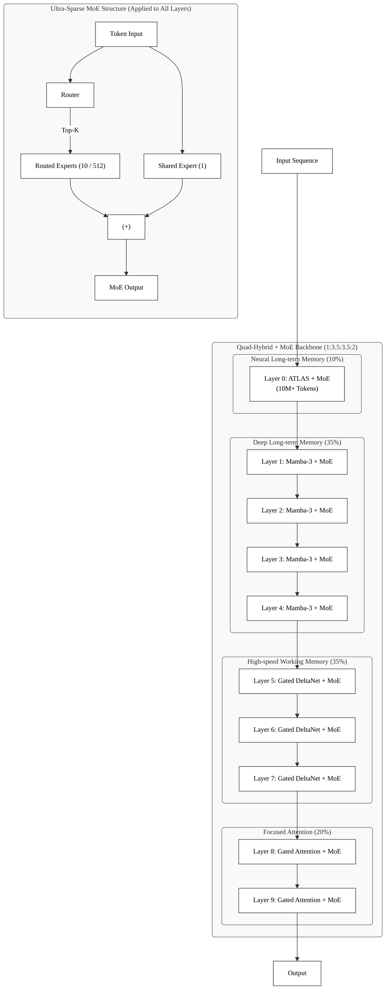
-->

**특징:**
- **모든 레이어에 MoE 적용**: Mamba-3, DeltaNet, Attention 블록 내부의 MLP가 MoE로 대체됨.
- **Ultra-Sparse**: 512개 전문가 중 11개(10 Routed + 1 Shared)만 활성화 (96%+ Sparsity).
- **Hybrid Pattern**: 4:4:2 비율로 메모리 특성에 따라 배치.

---

## 3. ATLAS 핵심 컴포넌트

### 3.1 Omega Rule: 윈도우 기반 최적화 (Context Memorization)
기존 RNN의 **토큰 단위(Online)** 학습과 달리, ATLAS는 **윈도우 단위(Sliding Window)**로 문맥을 학습합니다.
*   **Context over Tokens**: 개별 토큰이 아닌 '문맥(Context)'의 놀라움(Surprise)을 최소화하는 방향으로 메모리를 업데이트합니다.
*   **Parallelizability**: 윈도우 내부 연산과 그래디언트 흐름을 병렬화하여 학습 속도를 비약적으로 높입니다.

```python
# ATLAS (Omega Rule) - 윈도우마다 업데이트
for window_start in range(0, seq_len, window_size):
    window_k = k[window_start:window_start + window_size]
    window_v = v[window_start:window_start + window_size]

    for _ in range(optimization_steps):  # 윈도우 내 여러 번 최적화
        loss = mse(memory(window_k), window_v)
        memory.update(grad(loss))  # 윈도우당 업데이트
```

### 3.2 Polynomial Kernel: 초고용량 메모리 (High Capacity)
*   **이론적 배경**: $exp(q \cdot k)$ (Softmax Attention)를 테일러 급수로 근사하는 것과 유사하게, 다항 커널(Polynomial feature map)을 사용하여 **Super-linear Capacity**를 달성합니다.
*   **효과**: 메모리 파라미터 $M$이 $d_k$ 차원일 때, $O(d_k)$가 아닌 $O(d_k^p)$의 정보를 저장할 수 있어 소형 모델에서도 거대 지식을 압축할 수 있습니다.

```python
# Linear Kernel (기존) - O(d_k) 용량
φ(x) = x  # 선형 특징

# Polynomial Kernel (ATLAS) - O(d_k^p) 용량
φ(x) = [x, x⊗x, x⊗x⊗x, ...]  # 다항 특징
```

### 3.3 Deep MLP Memory: 심층 메모리 구조
*   단순 연관 행렬(Associative Matrix) 대신 **2-layer 이상의 MLP**를 메모리 $M$으로 사용합니다.
*   이는 메모리 업데이트 규칙(Update Rule)이 단순 덧셈이 아닌, **비선형 최적화(Gradient Descent in Inner Loop)**가 됨을 의미합니다.

```python
# ATLAS (Deep MLP) - 풍부한 표현력
M(x) = W_2 * σ(W_1 * x + b_1) + b_2  # 2-layer
```

### 3.4 Muon Optimizer: 2차 최적화 (Second-order Optimization)
*   **Inner Loop Optimization**: 메모리 $M$을 업데이트할 때, 일반적인 SGD 대신 **Muon (Momentumized Newton-Schulz)** 옵티마이저를 사용합니다.
*   **곡률 정보(Curvature)**: 2차 미분 정보를 활용하여 메모리가 최적의 상태로 빠르게 수렴하도록 돕습니다. 이는 단 몇 번의 스텝(Optimization Steps)만으로도 긴 문맥을 완벽히 기억하게 합니다.

```python
# Muon (2차) - 곡률 정보 활용
m = β1 * m + (1-β1) * grad      # 1차 모멘텀
v = β2 * v + (1-β2) * grad²     # 2차 모멘텀 (곡률 근사)
θ = θ - lr * m / sqrt(v + ε)    # Newton-Raphson 근사
```

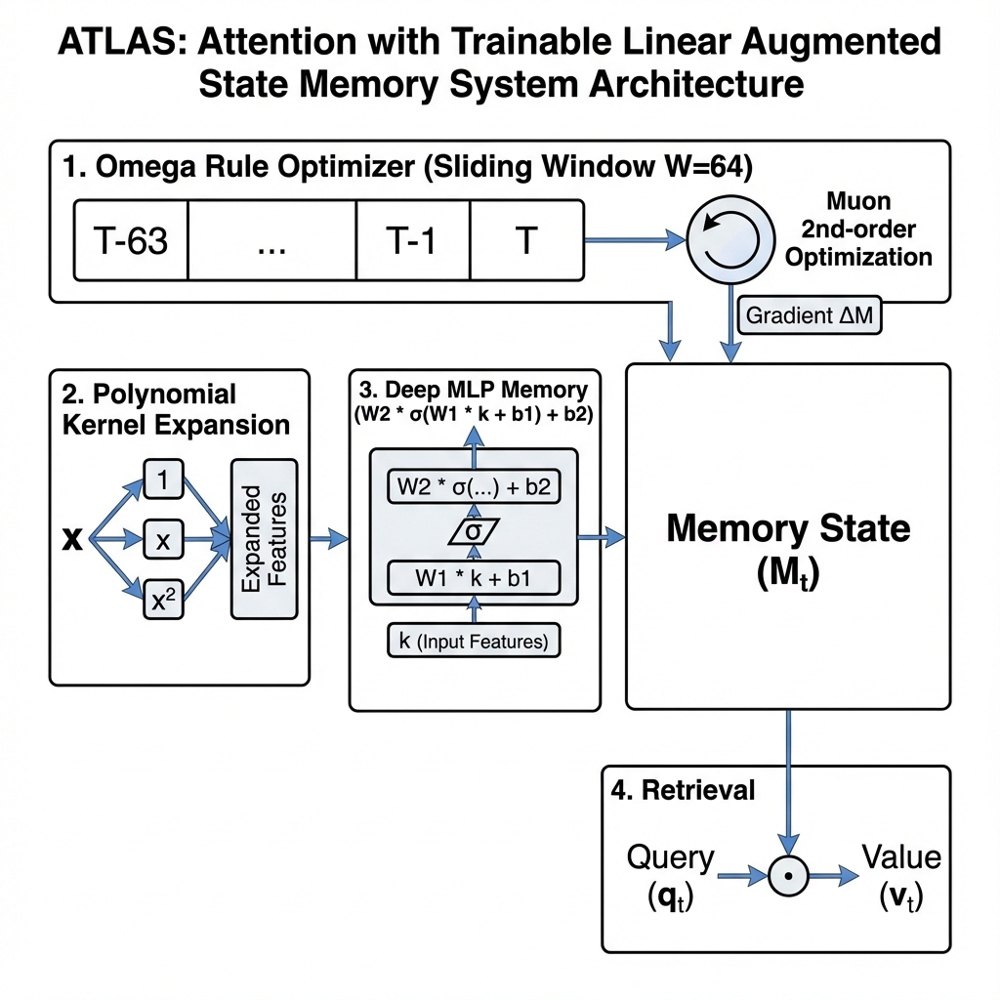

---

## 4. 모델 학습 및 생성 최적화 전략 (Training & Generation Strategy)

### 4.1 학습 전략: Meta-Learning Framework (Bilevel Optimization)
ATLAS 및 Quad-Hybrid 모델은 두 개의 루프(Loop)로 구성된 학습 전략을 취합니다.

1.  **Inner Loop (Test Time Memorization)**:
    *   **대상**: 메모리 파라미터 ($M_t$)
    *   **알고리즘**: Omega Rule + Muon Optimizer
    *   **역할**: 현재 문맥(Context)을 즉석에서 학습하여 메모리에 압축. (일시적/동적 학습)
2.  **Outer Loop (Weight Optimization)**:
    *   **대상**: 모델 가중치 ($\theta_{model}$)
    *   **알고리즘**: AdamW
    *   **역할**: 메모리가 잘 학습되도록 하는 '학습 규칙'과, 각 레이어의 변환 능력을 학습. (영구적/정적 학습)

### 4.2 생성 최적화: Test Time Memorization (TTM)
생성 시점(Inference)에서도 모델은 멈춰있지 않고 **계속 학습**합니다.
*   **능동적 메모리**: 입력된 텍스트를 단순히 KV Cache에 쌓아두는 것이 아니라, **메모리 네트워크 $M$을 실시간으로 Fine-tuning**합니다.
*   **KV Cache 감소**: 10M+ 토큰의 초장기 문맥을 KV Cache로 유지하면 메모리가 폭발하지만, ATLAS는 이를 고정된 크기의 $M$ 파라미터로 압축하므로 **VRAM 사용량을 획기적으로 절감**합니다.

### 4.3 소형 모델 아키텍처 (Next-Gen Small Model)
이 아키텍처는 "작은 모델이 큰 모델을 이기는" 전략을 구사합니다.
*   **파라미터 효율성**: 지식을 모델 가중치에 모두 때려박는(Pre-training) 대신, 필요한 문맥을 실행 시간(Runtime)에 메모리에 로드(Context Memorization)합니다.
    *   **예시**: 7B 모델이 100B 모델 수준의 Context QA 성능 발휘.
*   **Retrieval 대체**: RAG(Retrieval-Augmented Generation) 시스템의 느린 검색 과정을, 모델 내부의 고속 **Neural Memory Lookup**으로 대체하여 속도와 정확도를 동시에 잡습니다.

---

## 5. ETD와 LaDiR의 관계 (수정됨)


<!-- ETD & LaDiR Relation Mermaid Code
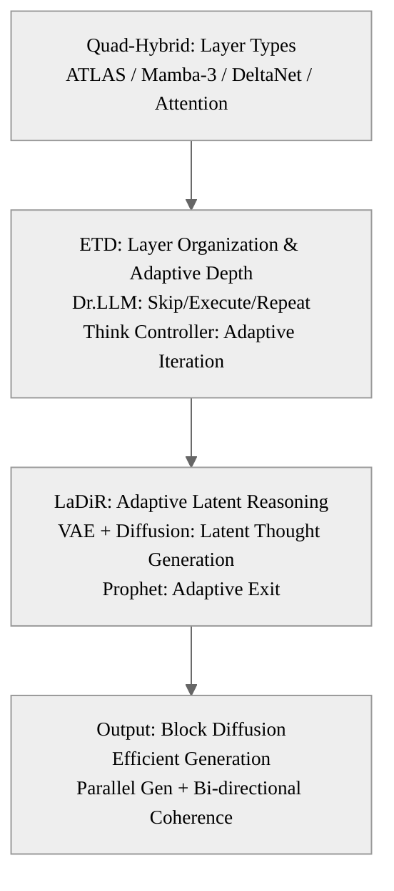
-->

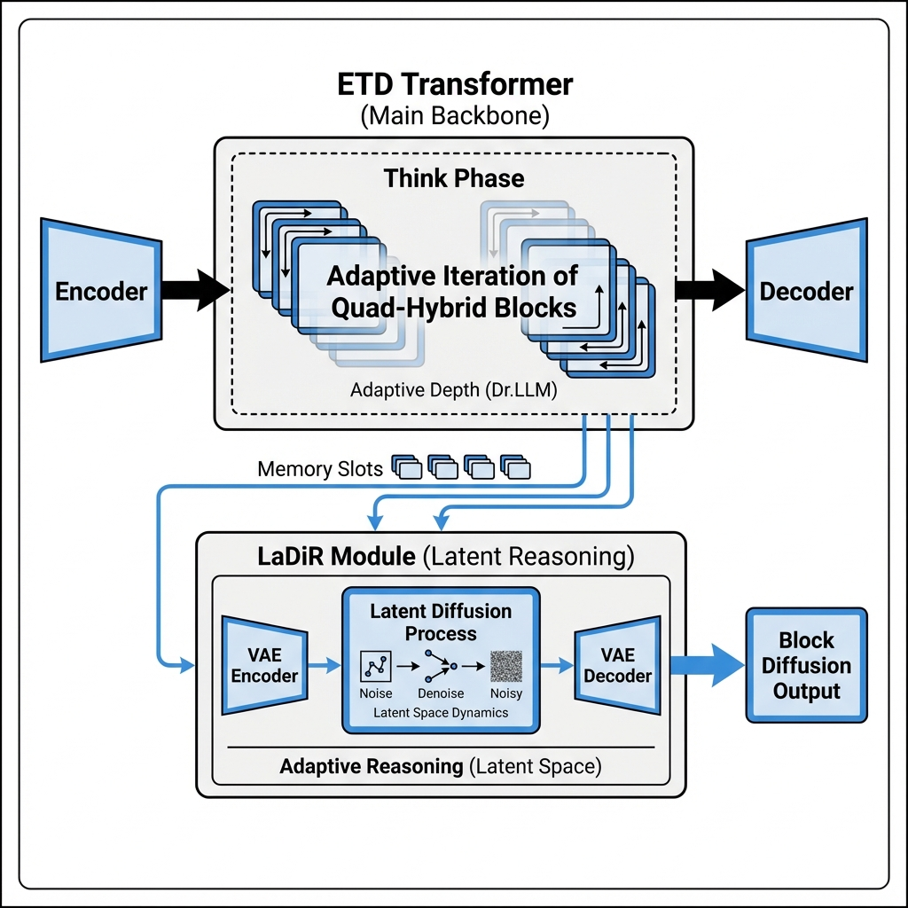

---

## 6. 각 레이어 상세

### Layer 1: Backbone (Quad-Hybrid) - "어떤 레이어?"

| 컴포넌트 | 파일 | 역할 | 메모리 타입 | 비율 | 용량 |
|---------|------|------|------------|------|------|
| **ATLAS** | `atlas_memory.py` | 초장기 신경 메모리 | Deep MLP + Omega | 10% | 10M+ |
| **Mamba-3** | `mamba_memory.py` | 심층 장기 기억 | 복소수 상태 공간 | 35% | ~100K |
| **Gated DeltaNet** | `gated_deltanet.py` | 고속 작업 기억 | 연관 행렬 (d×d) | 35% | ~10K |
| **Gated Attention** | `triple_hybrid.py` | 집중 주의 | KV Cache | 20% | Context |

### Layer 2: ETD Structure - "어떻게 구조화?" (Adaptive Depth & Diversity)

| 컴포넌트 | 역할 | 특징 |
|---------|------|------|
| **Encoder** | 입력 처리 | 1회 실행 |
| **Think** | 사고/추론 | **Adaptive Iteration** (Think Controller가 조기 종료 결정) |
| **Decoder** | 출력 생성 | 1회 실행 |
| **Router** | 동적 깊이 | **Dr.LLM** (Skip/Execute/Repeat 결정) - *How much to think* |
| **MoDr** | 전문가 분기 | **LoRA Experts** (전문가 선택) - *How to think* |

> [!NOTE]
> **Unified Adaptive Expert Recurrence**: ETD는 MoDr(다양성)와 Dr.LLM(효율성)을 통합하여 "정적 지식 저장소"에서 "동적 사고 엔진"으로 진화합니다. 쉬운 문제는 Skip으로 빠르게, 어려운 문제는 Repeat와 Expert로 깊게 처리합니다.

### Layer 3: LaDiR Reasoning - "어떻게 추론?" (Adaptive Reasoning)

| 컴포넌트 | 역할 | 특징 |
|---------|------|------|
| **LaDiRVAE** | 압축 | Reasoning → Latent (사고의 압축) |
| **LaDiRDiffusion** | 생성 | Flow Matching (잠재 공간 사고 생성) |
| **ProphetEarlyExit** | 가속 | **Adaptive Exit** (Confidence gap 기반 조기 종료) |

### Output Generation - "어떻게 출력?" (Efficient Generation)

| 컴포넌트 | 파일 | 역할 | 특징 |
|---------|------|------|------|
| **Block Diffusion** | `block_diffusion.py` | AR+Diffusion 하이브리드 | **Generation Speed** (2.5x) + **Coherence** |

---

## 7. 데이터 흐름

![Data Flow](https://mermaid.ink/img/JSV7aW5pdDogeyd0aGVtZSc6ICduZXV0cmFsJywgJ3RoZW1lVmFyaWFibGVzJzogeyAnZm9udEZhbWlseSc6ICdUaW1lcyBOZXcgUm9tYW4nLCAnZm9udFNpemUnOiAnMTRweCcsICdwcmltYXJ5Q29sb3InOiAnI2ZmZicsICdlZGdlTGFiZWxCYWNrZ3JvdW5kJzonI2ZmZicsICdjbHVzdGVyQmtnJzogJyNmOWY5ZjknLCAnY2x1c3RlckJvcmRlcic6ICcjNjY2JyB9fX0lJQpncmFwaCBURAogICAgSW5wdXRbSW5wdXQgVG9rZW5zXSAtLT4gQVRMQVMKICAgIAogICAgc3ViZ3JhcGggTGF5ZXIwIFtMYXllciAwXQogICAgICAgIEFUTEFTW0FUTEFTOiAxME0rIFRva2VuIE1lbW9yeTxici8+T21lZ2EgUnVsZSwgUG9seW5vbWlhbCBLZXJuZWwsIERlZXAgTUxQXQogICAgZW5kCiAgICAKICAgIEFUTEFTIC0tPiBFbmNvZGVyCiAgICAKICAgIHN1YmdyYXBoIEVURF9TdHJ1Y3R1cmUgW0VURCBTdHJ1Y3R1cmVdCiAgICAgICAgRW5jb2RlcltFTkNPREVSOiBRdWFkLUh5YnJpZCBMYXllcnM8YnIvPk1hbWJhLTMgKyBEZWx0YU5ldF0gLS0+IFRoaW5rCiAgICAgICAgCiAgICAgICAgVGhpbmtbVEhJTks6IEFkYXB0aXZlIEl0ZXJhdGlvbjxici8+VGhpbmsgQ29udHJvbGxlcjxici8+UXVhZC1IeWJyaWQgQmxvY2sgKyBSb3V0ZXIgKyBFeHBlcnRzXSAtLT4gRGVjb2RlcgogICAgICAgIAogICAgICAgIERlY29kZXJbREVDT0RFUjogUXVhZC1IeWJyaWQgTGF5ZXJzPGJyLz5BdHRlbnRpb24gKyBEZWx0YU5ldF0KICAgIGVuZAogICAgCiAgICBEZWNvZGVyIC0tPiBMYURpUl9Nb2QKICAgIAogICAgc3ViZ3JhcGggTGFEaVJfTGF5ZXIgW1NlcXVlbmNlIEVuZF0KICAgICAgICBMYURpUl9Nb2RbTGFEaVI6IExhdGVudCBSZWFzb25pbmc8YnIvPkhpZGRlbiBTdGF0ZXMgKyBNZW1vcnkgU2xvdHM8YnIvPlZBRSAtPiBEaWZmdXNpb24gLT4gUHJvcGhldF0KICAgIGVuZAogICAgCiAgICBMYURpUl9Nb2QgLS0+IEJsb2NrRGlmZgogICAgCiAgICBzdWJncmFwaCBPdXRwdXRfTGF5ZXIgW091dHB1dCBHZW5lcmF0aW9uXQogICAgICAgIEJsb2NrRGlmZltCbG9jayBEaWZmdXNpb248YnIvPkFSIGJldHdlZW4gYmxvY2tzICsgRGlmZnVzaW9uIHdpdGhpbiBibG9ja3NdCiAgICBlbmQKICAgIAogICAgQmxvY2tEaWZmIC0tPiBPdXRUb2tlbnNbT3V0cHV0IFRva2Vuc10=)

<!-- Data Flow Mermaid Code
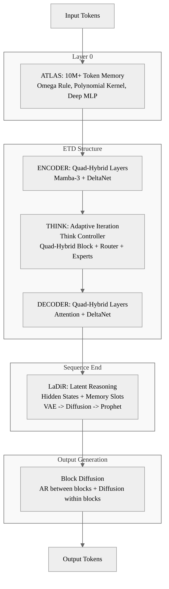
-->

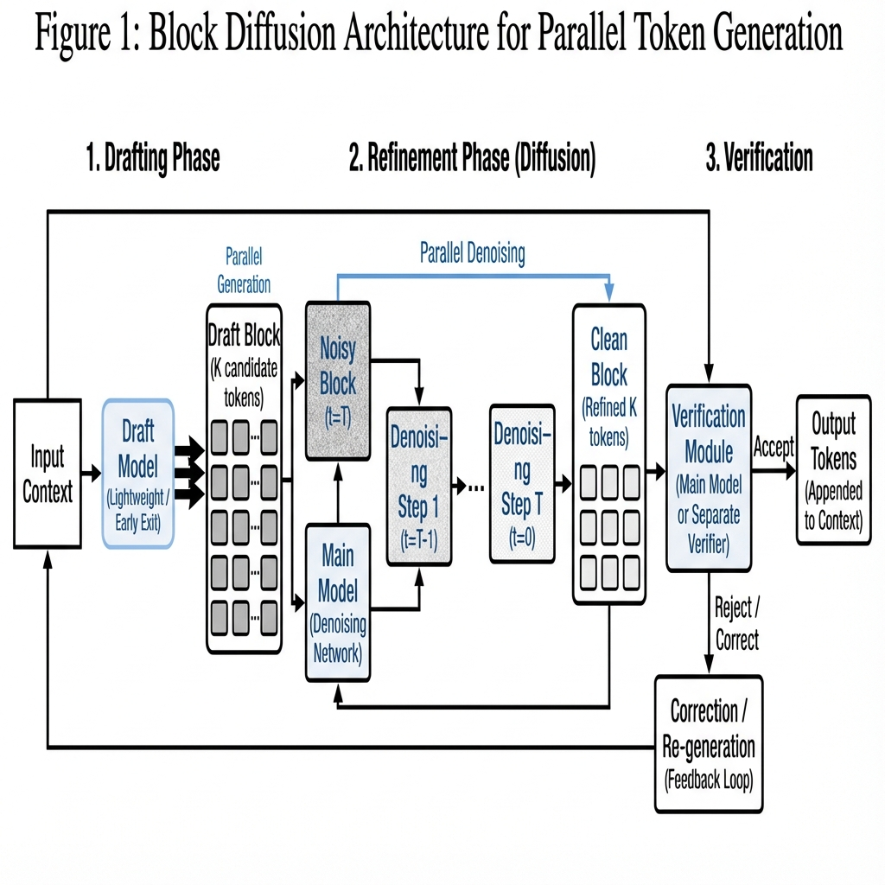

---

## 8. 파일 구조

```
OLMo-core/src/olmo_core/nn/transformer/
│
├── [BACKBONE - Layer 1: Quad-Hybrid]
│   │
│   ├── atlas_memory.py            # NEW ATLAS (Neural Long-term Memory)
│   │   ├── ATLASConfig            (Omega Rule + Polynomial Kernel 설정)
│   │   ├── PolynomialKernel       (용량 확장 커널)
│   │   ├── DeepMLPMemory          (2+ 레이어 메모리)
│   │   ├── OmegaRule              (윈도우 기반 최적화)
│   │   ├── MuonOptimizer          (2차 최적화)
│   │   ├── ATLASMemory            (통합 모듈)
│   │   ├── ATLASBlock             (Transformer Block)
│   │   ├── QuadHybridConfig       (4가지 메모리 통합 설정)
│   │   └── QuadHybridTransformer  (ATLAS + Triple-Hybrid)
│   │
│   ├── mamba_memory.py            # Mamba-3 (Deep Long-term Memory)
│   │   ├── Mamba3Config
│   │   ├── Mamba3
│   │   └── Mamba3Block
│   │
│   ├── gated_deltanet.py          # 기존 (Working Memory)
│   │   ├── GatedDeltaNetConfig
│   │   ├── GatedDeltaNet
│   │   └── GatedDeltaNetBlock
│   │
│   ├── attention/                  # 기존 (Focused Attention)
│   │   ├── __init__.py
│   │   ├── flash_attn_api.py
│   │   ├── kv_cache.py
│   │   └── ...
│   │
│   └── triple_hybrid.py            # 기존 (3가지 메모리 조합)
│       ├── TripleHybridConfig
│       ├── GatedAttention
│       └── TripleHybridTransformer
│
├── [ETD STRUCTURE - Layer Organization]
│   │
│   └── etd.py                      # 업데이트 (ETD + Quad-Hybrid 통합)
│       ├── ETDConfig               (기존 ETD 설정)
│       ├── ETDTransformer          (기존 블록 래핑)
│       ├── ThinkBlockController    (적응형 깊이)
│       ├── LayerRouter             (Skip/Execute/Repeat)
│       ├── MoDrExpertRouter        (LoRA experts)
│       │
│       ├── [ETD + Quad-Hybrid 통합]
│       ├── BackboneType            (STANDARD / TRIPLE_HYBRID / QUAD_HYBRID)
│       ├── ETDTripleHybridConfig   (통합 설정)
│       ├── ETDTripleHybridTransformer (E-T-D + Quad-Hybrid)
│       └── create_etd_triple_hybrid_model() (헬퍼 함수)
│
├── [REASONING - Layer 3: LaDiR] (시퀀스 END에서 작동!)
│   │
│   └── latent_reasoning.py         # 수정 (LaDiR만 유지)
│       ├── LaDiRConfig             (VAE + Diffusion 설정)
│       ├── ProphetConfig           (조기 종료 설정)
│       ├── LaDiRVAE                (Text → Latent 압축)
│       ├── LaDiRDiffusion          (Flow Matching 생성)
│       ├── FlowMatchingScheduler   (Noise scheduler)
│       ├── ProphetEarlyExit        (Confidence gap 조기 종료)
│       ├── LaDiRModule             (시퀀스 END에서 작동)
│       └── LatentReasoningWrapper  (ETD 출력 후 LaDiR 적용)
│
├── [OUTPUT GENERATION]
│   │
│   └── block_diffusion.py          # 메인 (Block Discrete Diffusion)
│       ├── BlockDiffusionConfig
│       ├── NoiseSchedule (LogLinear, Cosine, Exp)
│       ├── MaskDiffusion
│       ├── BlockDiffusionDecoder
│       └── BlockDiffusionWrapper
│
├── [OPTIONAL - 대안적 출력]
│   │
│   └── mtp.py                      # 대안 (속도 우선시)
│       ├── MTPConfig
│       ├── MTPHead
│       └── MTPSpeculativeDecoder
│
├── [CORE]
│   ├── block.py                    # 기본 Transformer block
│   ├── model.py                    # Transformer 모델
│   └── config.py                   # 설정
│
└── [DOCS]
    └── TRIPLE_HYBRID_ARCHITECTURE.md  # 이 문서 (-> QUAD_HYBRID로 rename 예정)
```

---

## 9. 통합 Configuration

```python
from dataclasses import dataclass, field
from olmo_core.config import Config

@dataclass
class FullArchitectureConfig(Config):
    """전체 아키텍처 통합 설정 (Quad-Hybrid)"""

    # === Layer 1: Quad-Hybrid Backbone ===
    backbone: QuadHybridConfig = field(default_factory=lambda: QuadHybridConfig(
        hidden_size=2048,
        num_layers=40,
        atlas_ratio=0.1,       # 10% ATLAS (초장기 메모리)
        mamba3_ratio=0.35,     # 35% Mamba-3 (장기 기억)
        deltanet_ratio=0.35,   # 35% DeltaNet (작업 기억)
        attention_ratio=0.2,   # 20% Attention (정밀 검색)

        # ATLAS specific
        atlas_window_size=64,
        atlas_optimization_steps=3,
        atlas_polynomial_degree=2,
        atlas_memory_layers=2,
        atlas_use_muon=True,
    ))

    # === Layer 2: ETD Structure ===
    etd: ETDConfig = field(default_factory=lambda: ETDConfig(
        num_encoder_layers=8,
        num_think_layers=24,    # Think 블록이 대부분
        num_decoder_layers=8,
        think_iterations=4,     # Think 반복 횟수
        use_router=True,        # 동적 라우팅
    ))

    # === Layer 3: LaDiR Reasoning ===
    ladir: LaDiRConfig = field(default_factory=lambda: LaDiRConfig(
        latent_dim=128,
        num_memory_slots=3,
        num_inference_steps=50,
        prophet=ProphetConfig(
            enabled=True,
            threshold_early=7.5,
            threshold_mid=5.0,
            threshold_late=2.5,
        ),
    ))

    # === Output Acceleration ===
    block_diffusion: BlockDiffusionConfig = field(default_factory=lambda: BlockDiffusionConfig(
        block_size=16,
        noise_schedule="log_linear",
    ))
```

---

## 10. Implementation Roadmap

### Phase 1: Backbone (Triple-Hybrid) COMPLETED
- [x] `mamba_memory.py` 생성 - Mamba-3 (Complex SSM) 구현
- [x] `triple_hybrid.py` 생성 - 4:4:2 비율 레이어 조합
- [x] 기존 `gated_deltanet.py` 연동 확인

### Phase 2: ETD Integration COMPLETED
- [x] `etd.py`와 Triple-Hybrid 통합
- [x] Think Block에서 Triple-Hybrid 레이어 사용하도록 수정

### Phase 3: LaDiR Cleanup COMPLETED
- [x] `latent_reasoning.py` deprecated 코드 제거
- [x] LaDiR 전용으로 정리

### Phase 4: ATLAS Integration COMPLETED
- [x] `atlas_memory.py` 생성
  - [x] `ATLASConfig` 설정
  - [x] `PolynomialKernel` 구현
  - [x] `DeepMLPMemory` 구현
  - [x] `OmegaRule` 구현
  - [x] `MuonOptimizer` 구현
  - [x] `ATLASMemory` 통합 모듈
  - [x] `ATLASBlock` Transformer Block
  - [x] `QuadHybridConfig` 설정
  - [x] `QuadHybridTransformer` 통합 모델

### Phase 5: Output Layer Integration
- [ ] `block_diffusion.py` 연동 확인
- [ ] MTP 대안으로 유지

### Phase 6: Full Integration & Testing
- [ ] 전체 파이프라인 통합
- [ ] Configuration 통합 클래스 생성
- [ ] 단위/통합 테스트
- [ ] 성능 벤치마크

---

## 11. Summary

![Summary](https://mermaid.ink/img/JSV7aW5pdDogeyd0aGVtZSc6ICduZXV0cmFsJywgJ3RoZW1lVmFyaWFibGVzJzogeyAnZm9udEZhbWlseSc6ICdUaW1lcyBOZXcgUm9tYW4nLCAnZm9udFNpemUnOiAnMTRweCcsICdwcmltYXJ5Q29sb3InOiAnI2ZmZicsICdlZGdlTGFiZWxCYWNrZ3JvdW5kJzonI2ZmZicsICdjbHVzdGVyQmtnJzogJyNmOWY5ZjknLCAnY2x1c3RlckJvcmRlcic6ICcjNjY2JyB9fX0lJQptaW5kbWFwCiAgcm9vdCgoQVJDSElURUNUVVJFPGJyLz5TVU1NQVJZKSkKICAgIFF1ZXN0aW9ucwogICAgICBMYXllclR5cGVbIlF1YWQtSHlicmlkIl0KICAgICAgU3RydWN0dXJlWyJFVEQgKEFkYXB0aXZlIERlcHRoKSJdCiAgICAgIFJlYXNvbmluZ1siTGFEaVIgKEFkYXB0aXZlIFJlYXNvbmluZykiXQogICAgICBPdXRwdXRbIkJsb2NrIERpZmZ1c2lvbiAoRWZmaWNpZW50IEdlbikiXQogICAgTWVtb3J5U3lzdGVtcwogICAgICBBVExBU1siQVRMQVMgKDEwTSspIl0KICAgICAgTWFtYmEzWyJNYW1iYS0zICh+MTAwSykiXQogICAgICBEZWx0YU5ldFsiRGVsdGFOZXQgKH4xMEspIl0KICAgICAgQXR0ZW50aW9uWyJBdHRlbnRpb24gKENvbnRleHQpIl0KICAgIEZpbGVzCiAgICAgIEJhY2tib25lWyJhdGxhc19tZW1vcnkucHk8YnIvPm1hbWJhX21lbW9yeS5weTxici8+Z2F0ZWRfZGVsdGFuZXQucHk8YnIvPnRyaXBsZV9oeWJyaWQucHkiXQogICAgICBTdHJ1Y3R1cmVbImV0ZC5weSJdCiAgICAgIFJlYXNvbmluZ1sibGF0ZW50X3JlYXNvbmluZy5weSJdCiAgICAgIE91dHB1dFsiYmxvY2tfZGlmZnVzaW9uLnB5Il0=)

<!-- Summary Mermaid Code
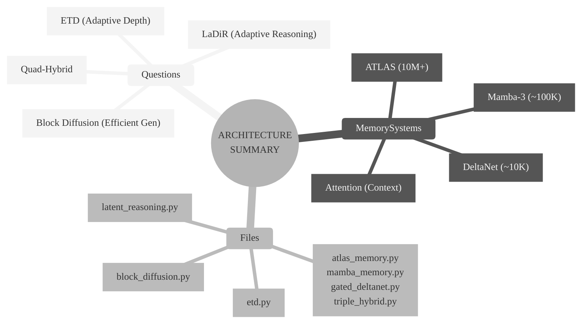
-->

---

## 12. 구현 상태 (Implementation Status)

### 직접 구현 (From Scratch)

다음 컴포넌트들은 논문을 기반으로 **직접 구현**되었습니다 (공식 repo 없음):

| 파일 | 클래스 | 출처 논문 | 설명 |
|------|--------|-----------|------|
| `atlas_memory.py` | `PolynomialKernel` | ATLAS (arXiv:2505.23735) | 다항 커널 φ(x) = [x, x⊗x, ..., x^⊗p] |
| `atlas_memory.py` | `DeepMLPMemory` | ATLAS | 2+ 레이어 MLP 메모리 (Eq. 32-33) |
| `atlas_memory.py` | `OmegaRule` | ATLAS | 윈도우 기반 최적화 (Eq. 9) |
| `atlas_memory.py` | `MuonOptimizer` | ATLAS | Newton-Schulz 2차 최적화 |
| `atlas_memory.py` | `ATLASMemory` | ATLAS | 통합 Neural Long-term Memory |
| `atlas_memory.py` | `ATLASBlock` | ATLAS | Transformer 블록 래퍼 |
| `atlas_memory.py` | `QuadHybridConfig` | - | Quad-Hybrid 설정 (신규) |
| `atlas_memory.py` | `QuadHybridTransformer` | - | 4가지 메모리 통합 (신규) |

### 공식 Repo 기반 (Adapted from Official Repositories)

다음 컴포넌트들은 **공식 GitHub repo**를 참조/적용했습니다:

| 파일 | 클래스 | 공식 Repo | 설명 |
|------|--------|-----------|------|
| `latent_reasoning.py` | `LaDiRVAE` | [mk322/LaDiR](https://github.com/mk322/LaDiR) | VAE Encoder/Decoder 적용 |
| `latent_reasoning.py` | `FlowMatchingScheduler` | [mk322/LaDiR](https://github.com/mk322/LaDiR) | Rectified Flow 스케줄러 |
| `latent_reasoning.py` | `LaDiRDiffusion` | [mk322/LaDiR](https://github.com/mk322/LaDiR) | Flow Matching 생성 |
| `latent_reasoning.py` | `LaDiRModule` | [mk322/LaDiR](https://github.com/mk322/LaDiR) | OLMo-core 통합 래퍼 |
| `latent_reasoning.py` | `ProphetEarlyExit` | Prophet (arXiv:2508.19982) | Confidence gap 조기 종료 |
| `block_diffusion.py` | `NoiseSchedule` | [NVlabs/Fast-dLLM](https://github.com/NVlabs/Fast-dLLM) | BD3-LM 노이즈 스케줄 |
| `block_diffusion.py` | `MaskDiffusion` | [NVlabs/Fast-dLLM](https://github.com/NVlabs/Fast-dLLM) | Masked Diffusion |
| `block_diffusion.py` | `BlockDiffusionDecoder` | [NVlabs/Fast-dLLM](https://github.com/NVlabs/Fast-dLLM) | AR + Diffusion 하이브리드 |
| `block_diffusion.py` | `ReplacePositionKVCache` | [NVlabs/Fast-dLLM](https://github.com/NVlabs/Fast-dLLM) | 위치별 KV cache 교체 |

**LaDiR 훈련**: `/home/sk/ws/llm/LaDiR/` 에서 공식 repo로 VAE 훈련 진행
**Block Diffusion 참조**: BD3-LM (arXiv:2503.09573) + Fast-dLLM v2 (arXiv:2505.22618)

### 기존 라이브러리 사용

다음 컴포넌트들은 **기존 라이브러리**를 활용합니다:

| 파일 | 사용 라이브러리 | 버전 | 역할 |
|------|----------------|------|------|
| `mamba_memory.py` | `mamba-ssm` | >=2.0 | Mamba-3 Complex SSM 커널 |
| `gated_deltanet.py` | `fla` (flash-linear-attention) | - | DeltaNet 커널 |
| `model.py` | `flash-attn` | >=2.0 | Flash Attention 커널 |

### 기존 코드 확장

다음 컴포넌트들은 기존 OLMo-core 코드를 **확장**했습니다:

| 파일 | 기반 클래스 | 확장 내용 |
|------|------------|----------|
| `mamba_memory.py` | `TransformerBlockBase` | Mamba3Block 래퍼 |
| `gated_deltanet.py` | `TransformerBlockBase` | GatedDeltaNetBlock 래퍼 |
| `triple_hybrid.py` | `nn.Module` | TripleHybridTransformer 조합 |
| `etd.py` | `Transformer` | ETDTransformer 구조화 |

### ATLAS 논문 수식 대응

```
Omega Rule (Eq. 9):
  min_M Σ_{i=t-c+1}^{t} γ_i ||M(k_i) - v_i||²
  → OmegaRule.update_memory()

Polynomial Kernel:
  φ_p(x) = [x^β]_{1≤|β|≤p}
  → PolynomialKernel.forward()

Deep MLP (Eq. 32-33):
  M(x) = x + W₁σ(W₂x + b₂) + b₁
  → DeepMLPMemory.forward()

Muon Optimizer:
  Newton-Schulz iteration for 2nd order
  → MuonOptimizer.step()
```

### 참고

- ATLAS 공식 repo는 2025-12-05 기준 아직 공개되지 않음 (논문: 2025-05-29)
- 구현은 arXiv:2505.23735v1 논문을 기반으로 함

---

## 12. References

1. **ATLAS**: "Learning to Optimally Memorize the Context at Test-time" (arXiv:2505.23735, 2025)

3. **Mamba-3**: "Improved Sequence Modeling using State Space Principles" (2025)
4. **Gated DeltaNet**: "Improving Mamba2 with Delta Rule" (arXiv:2412.06464)
5. **ETD**: "Encode, Think, Decode" (arXiv:2510.07358)
6. **LaDiR**: "Latent Diffusion for Reasoning" (arXiv:2510.08558)
7. **Prophet**: "Early Commit Decoding" (arXiv:2508.19982)
8. **BD3-LM**: "Block Discrete Denoising Diffusion" (arXiv:2503.09573, ICLR 2025)
9. **MoDr**: "Mixture-of-Depth-Recurrent Transformers" (OpenReview)
10. **Dr.LLM**: "Dynamic Layer Routing in LLMs" (arXiv:2510.12773)
11. **Unified Analysis**: "MoDr, Dr. LLM, ETD 통합 가능성 분석" (Internal Report)

---

*문서 작성일: 2025-12-05*
*업데이트: ATLAS (Neural Long-term Memory) 통합*
*작성자: AI Architect*
